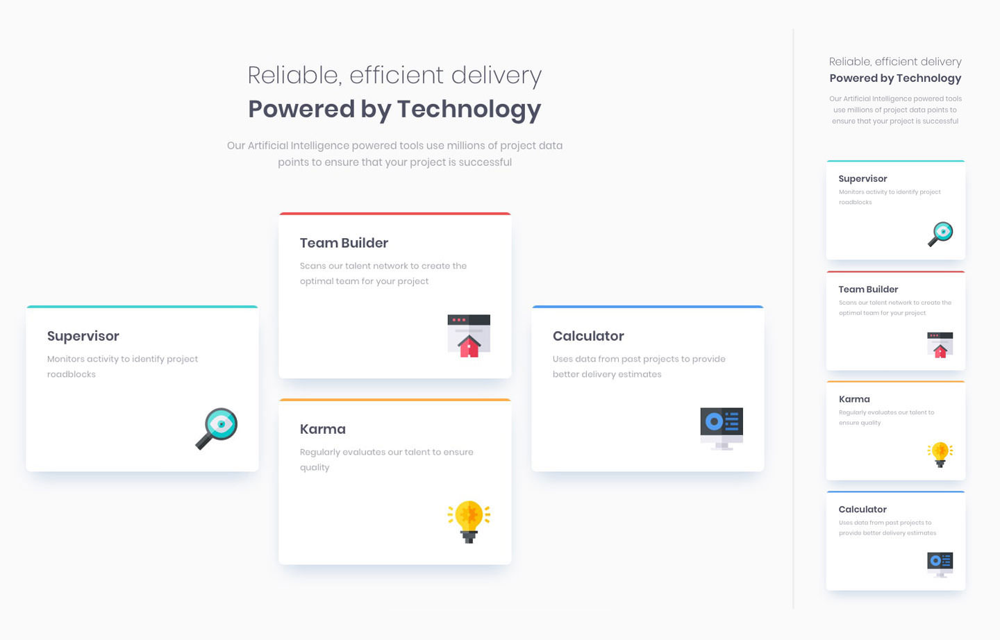

# [Frontend Mentor - Four card feature section Challenge](https://www.frontendmentor.io/challenges/four-card-feature-section-weK1eFYK/hub/four-card-feature-section-nDp7no7HE4)

- ## [Deployed on Vercel](https://fm-four-card-feature-section-chi.vercel.app/)
- ## [GitHub Repository](https://github.com/panosjapan7/fm-four-card-feature-section)
- ## [My Frontend Mentor Profile](https://www.frontendmentor.io/profile/panosjapan7)
** **
- ### Built with
    - Semantic HTML5 markup
    - CSS
    - Flexbox

